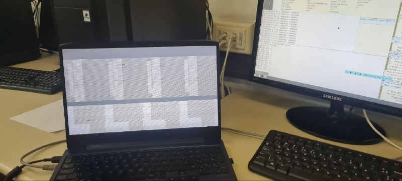

No mês de novembro tive muito progresso, conseguindo deixar o meu código completamente funcional, porém o código ainda possui problemas e faltam testes em outro tipo de hardware.

Acabei gastando em torno de 48h entre programação e testes este mês, sendo o mais intenso em quebragem, também conversei com colegas coordenadores do sistema operacional sobre o progresso do código e estamos procurando pessoas para testar o código em arquiteturas compatíveis para garantir que não há quebragem e que o código faça o correto antes mesmo de considerar fazer um merge do código. Não só isso como eu e mais um deles decidímos comprar as novas placas de vídeo da Intel e extender parte deste código para elas, para futuramente trazer o resto do código a par do que há de novo.

# Rework

  Acabei notando que talvez precisaria ligar todos os portões lógicos que controlam a energia distribuida ao controlador de vídeo, e com isso liguqi todos por padrão.

# Uma história envolvendo DisplayPort, o padrão de vídeo do controlador.

Após fazer um rework da partes de clock no começo do programa, acabava tendo outro problema:  a tela piscava, e ficava alguns milissegundos em um modo estranho, e logo depois parava de funcionar.

Depois de investigar um pouco as possiblidades (questões de numeros de clock errado, talvez apontando pra um Pipe diferente do que deveria ser apontado internamente, etc) acabei notando que o problema que tinha ali era relacionado a negociação do link do padrão DisplayPort, o que acabou sendo um problema no começo até ter que observar o padrão do Linux por falta de alternativas.

Acontece que os sinais que mandamos nos nossos computadores digitais não são realmente digitais, eles vem de ondas analógicas que tentam ser moduladas para serem interpretadas digitalmente, e que na realidade são [ondas curvas](https://en.wikipedia.org/wiki/Eye_pattern), e  isso demanda que além de todos os problemas físicos de sincronização de relógios que podemos ter, existe a questão dos sinais serem elétricos e ter niveis aceitaveis de tensão que os sinais podem variar (dependendo da frequencia os níveis de tensão precisam serem mais rígidos, já que se tem menos tempo para saber com certeza o estado desse sinal.), ainda mais para um padrão de vídeo, que é pensado para mandar um sinal sem defeitos por um cabo que pode estar mal isolado a métros de distancia, isso implica que temos de ter muito cuidado com os sistemas de integridade de sinal tanto a nível digital quanto a nível analógico. Acontece que a Intel tem um conjunto de 20 registradores que fazem a negociação do DisplayPort sobre o quão rigido vão ser esses timings de potencia de linha e de ruído, esses registradores acabam não só variando de arquitetura para arquitetura mas também de modelo a modelo e de tipo de painel, o que me gerou confusão visto que tinha previamente modificado o código para registrar uma especificação da potencia de linha adequada para operação de um modelo da minha arquitetura. 

Isso foi dificil de entender, pois além de tudo isso o padrão DisplayPort é propietário somente acessível para membros de um comitê, o [VESA](https://vesa.org/), acabei só entendendo que esses valores estavam diferentes no Linux ao fazer engenharia reversa caixa-preta e lendo os registradores BUF_TRANS vi que os do Linux não só eram diferentes dos que eu utilizava, como também poderiam mudar dependendo do tempo que eu lia o estado da máquina, para piorar notei que tinha valores diferentes em maquinas diferentes com a mesma arquitetura de processador gráfico/de vídeo.

Outra coisa foi que o DisplayPort tem um barramento/canal especial para o display e emissor de vídeo se comunicarem que se chama AUX Channel, acontece que o comportamento do driver atual que tinhamos não era conformante as ultimas especificações do padrão (que não temos acesso), e isso pode facilmente trazer _Undefined Behaviour_ segundo a propia especificação, nesse caso em específico o comportamento dos displays embutidos não é bem definido mas é bem comportado, visto que os painéis continuam a funcionar normalmente porém podem jogar lixo em regiões que não importam para a negociação do padrão de video, acontece que dei sorte, mas um cleanup será necessário no futuro.

Com isso, após consertar isso tudo obtive um largo progresso, obtendo vídeo pela minha primeira vez!

Uh oh! Como pode ver, o display exibe uma imagem agora, mas no caso não estava correto de nenhum modo. Parecia obviamente um problema de um clock muito alto, logo voltei a olhar o código dos clocks.

